<div align="center">

# Snip.

**Short, focused notes on what you're learning — like Twitter, but strictly for education and life skills.**

</div>

Snips is a minimal, Twitter-style feed for sharing short educational notes: what you just learned, a tip that stuck with you, a concept explained in a couple of sentences. Rich-text posts with image/video/YouTube attachments, tags, likes, nested comments, follows, search, and a Reels-style full-screen "Scroll" feed — built as a small full-stack app with a React/MUI frontend and a Go backend on Firebase.

## Screenshots

<table>
<tr>
<td width="50%">

**Sign in** — Google or email/password
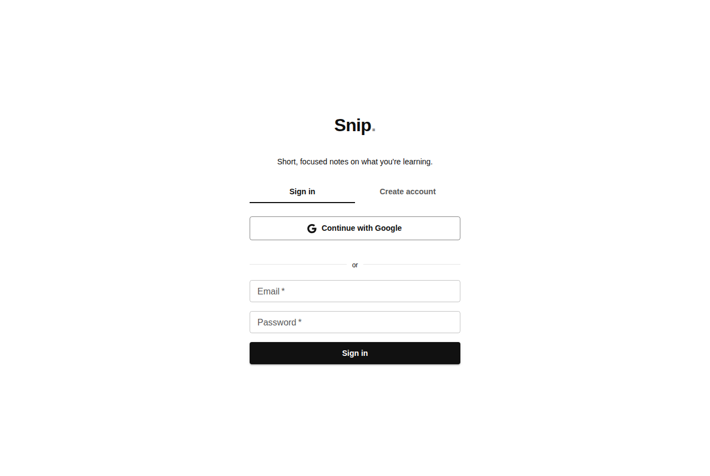

</td>
<td width="50%">

**Home feed** — Quill composer, tags, likes, comment counts
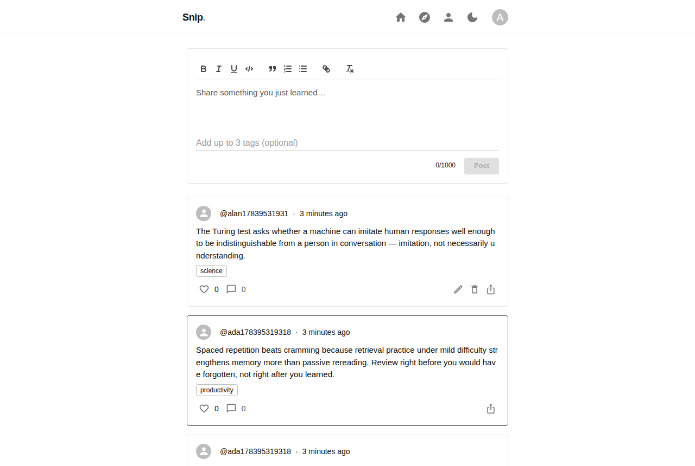

</td>
</tr>
<tr>
<td width="50%">

**Dark theme** — one click, everywhere
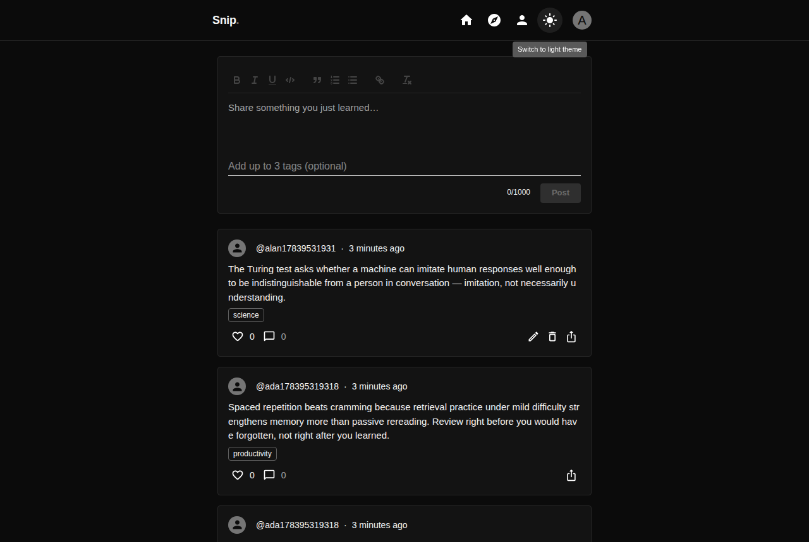

</td>
<td width="50%">

**Discover** — Recent / Top / Following / Search tabs
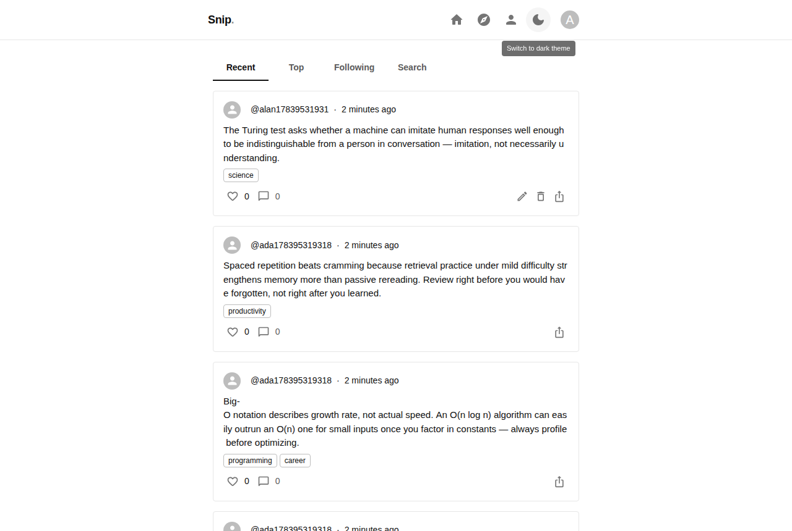

</td>
</tr>
<tr>
<td width="50%">

**Tag search** — filter by topic
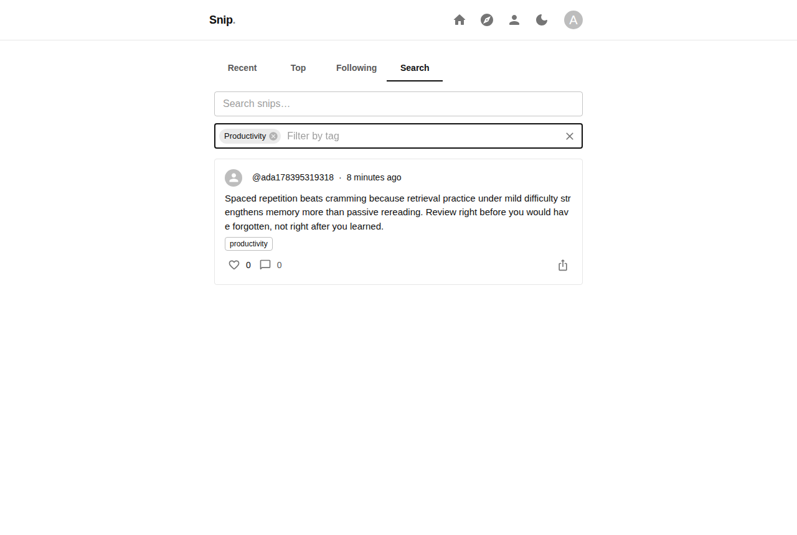

</td>
<td width="50%">

**Profile** — follow state, bio, published snips
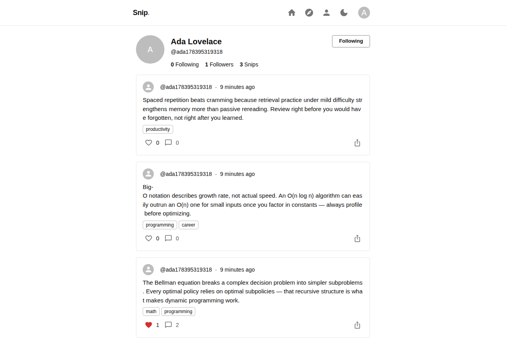

</td>
</tr>
<tr>
<td width="50%">

**Nested comments** — reply to a reply
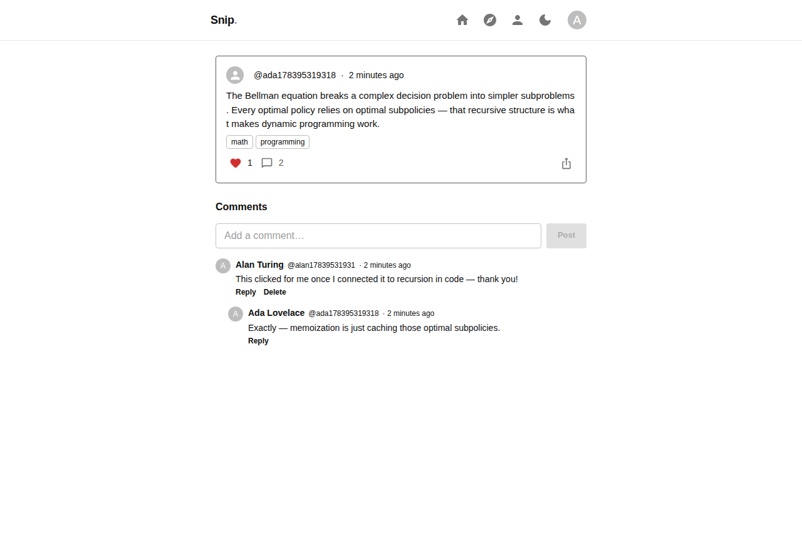

</td>
<td width="50%">

**Share sheet** — copy link, native share, social intents
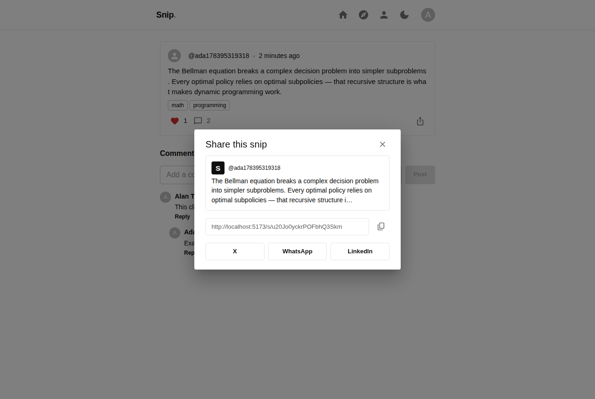

</td>
</tr>
</table>

**Mobile** — Discover collapses to an icon-only bottom nav bar on small viewports:

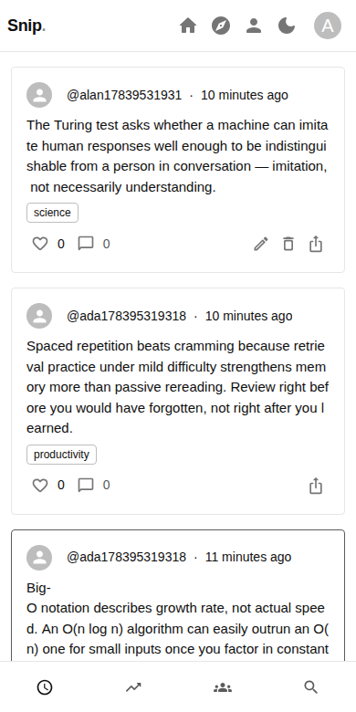

### Scroll — the Reels-style feed

<table>
<tr>
<td width="50%">

**Scroll** — full-screen, swipeable feed with an image/video carousel per post; the pool reshuffles and loops once exhausted instead of running dry
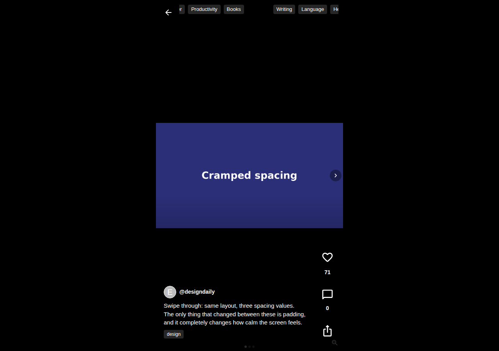

</td>
<td width="50%">

**YouTube, inline** — paste a link (including Shorts URLs) and it plays right in the feed, framed so YouTube's own controls stay fully usable
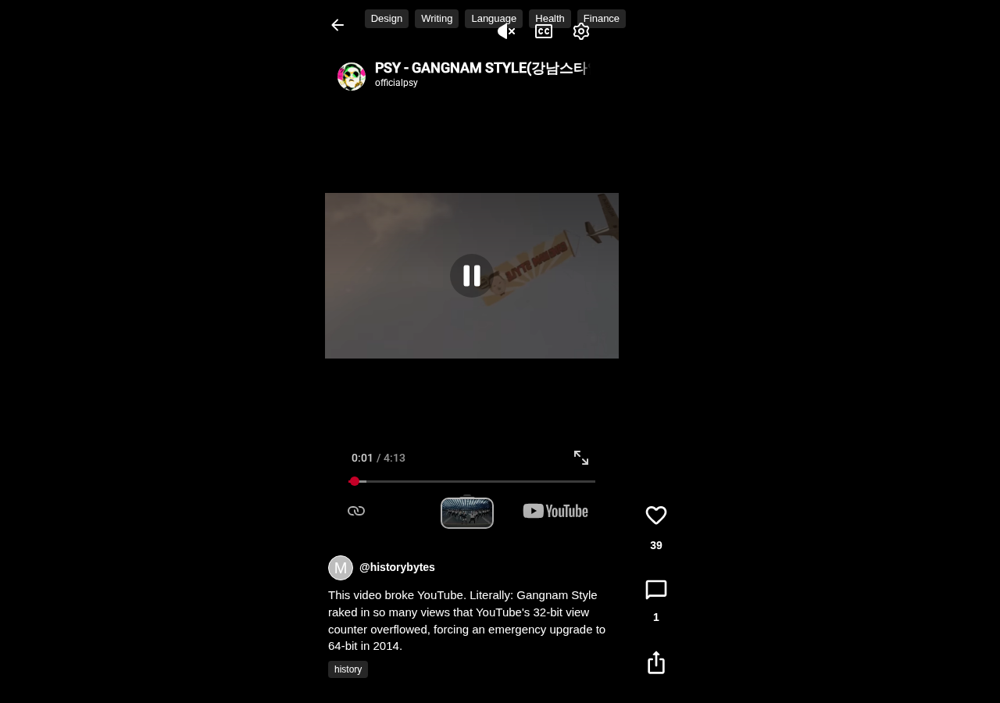

</td>
</tr>
<tr>
<td width="50%">

**Comments without leaving Scroll** — a bottom-sheet drawer over the video, instead of breaking the scroll session
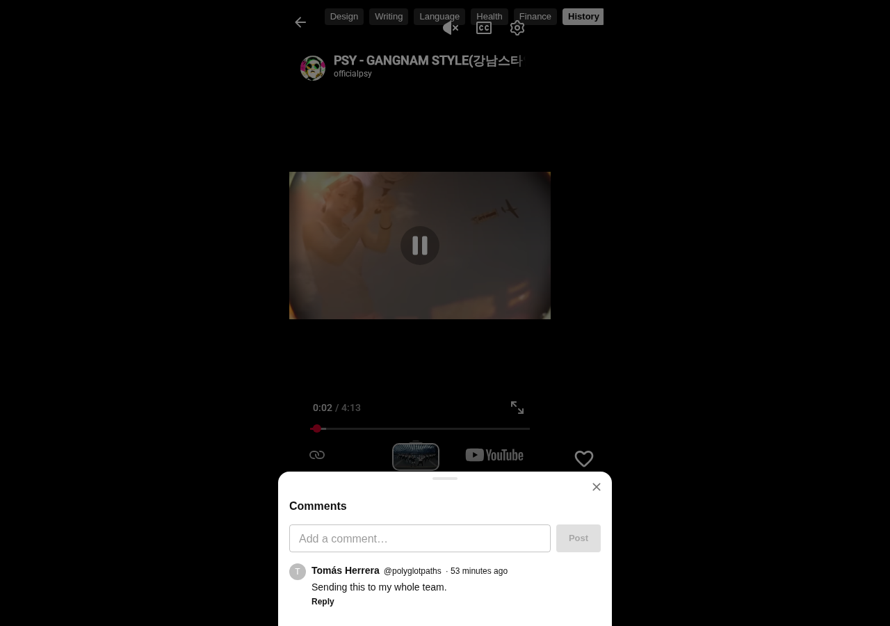

</td>
<td width="50%">

**Multi-image posts** — the same swipeable carousel (dots, arrows) works inline in the regular feed too, with a tap-to-zoom lightbox
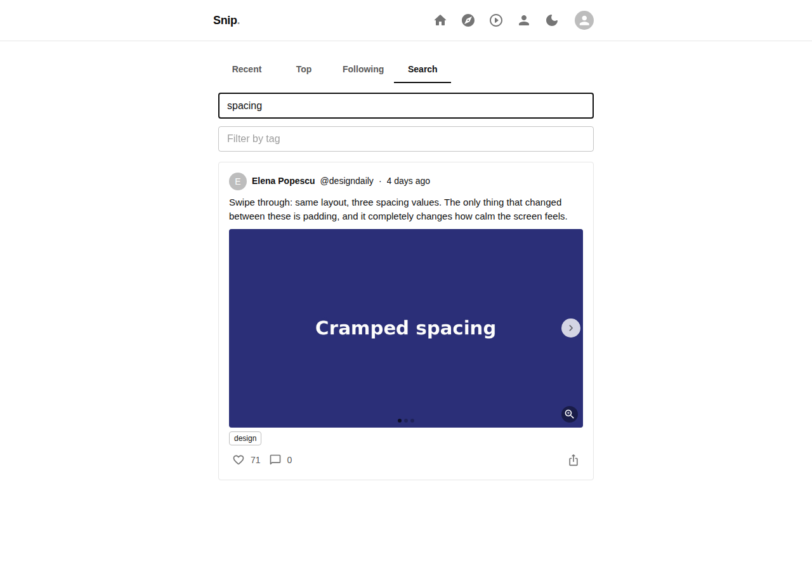

</td>
</tr>
</table>

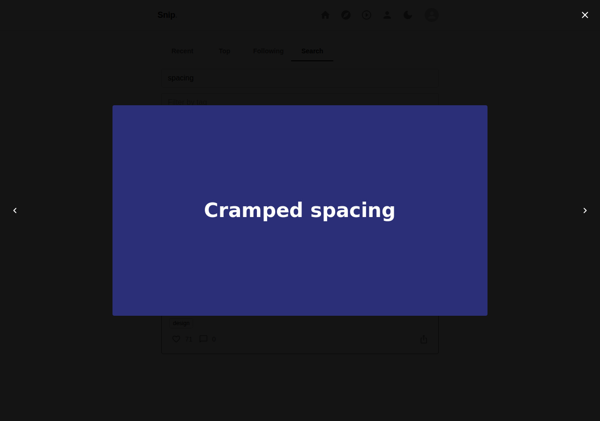

## Features

- **Auth**: Google or email/password sign-in via Firebase Auth, with one-time username claim on first login
- **Rich-text posts**: Quill-based composer (bold/italic/underline/code/lists/quotes/links), edited posts show an "edited" badge
- **Media attachments**: images and video upload straight to Firebase Storage (never through Firestore, which has a 1 MiB document cap); pasted YouTube links (including Shorts) are detected and embedded automatically. Multiple attachments on one snip render as a swipeable carousel, in both the regular feed and Scroll, with a tap-to-zoom lightbox for images
- **Scroll**: a full-screen, vertically-snapping Reels/TikTok-style feed with its own tag filter; video autoplays muted while active (with a visible tap-for-sound affordance) and the content pool reshuffles and loops once exhausted rather than running dry
- **Tags & search**: up to 3 tags per snip (recommended chips or custom), Discover's Search tab filters by tag or free text
- **Social graph**: follow/unfollow, followers/following lists, a Following-scoped feed
- **Likes & nested comments**: threaded replies at any depth, with cascade delete; commenting from Scroll opens a bottom-sheet drawer instead of leaving the feed
- **Share sheet**: copy link, native Web Share API, X/WhatsApp/LinkedIn intents, live-updating page title/description
- **Feed caching**: Feed and Discover cache their last-loaded list and show it instantly on revisit, with a background poll that surfaces fresher content via a "new snips" pill (or pull-to-refresh) instead of silently swapping the list underneath you
- **Light/dark theme**: persisted, respects system preference on first load
- **Responsive**: bottom icon nav on narrow viewports where a full tab bar wouldn't fit

## Tech stack

**Frontend** (this folder): React 19 + TypeScript + Vite, Material UI (minimal border radius, custom light/dark theme), `react-quill-new`, `react-router-dom`, Firebase Auth + Storage (client SDK), Axios, DOMPurify for sanitizing rendered rich text. YouTube embeds are plain `youtube-nocookie.com` iframes built from a strictly-validated video ID — no SDK or extra dependency involved.

**Backend** (`../../snips.backend`): Go + Gin, one package per service (`auth`, `user`, `post`, `like`, `follow`, `comment`, `feed`) each with its own model/repository/service/handler, Firebase Admin SDK (Auth verification + Firestore), rate limiting, request size limits, and access logging. The post service also validates server-side that any image/video URL embedded in a snip actually points at this project's own Storage bucket, so the frontend's checks aren't the only thing standing between a crafted request and a hotlinked/tracking payload.

**Data**: Firestore for everything except media bytes (images/video go straight from the browser to Firebase Storage, never through Firestore, which has a 1 MiB per-document limit) — the frontend never talks to Firestore directly, everything goes through the Go backend, so Firestore security rules can (and should) deny client access entirely (`allow read, write: if false`).

## Getting started

### Backend

```bash
cd snips.backend
# .env: PORT, FIREBASE_PROJECT_ID, FIREBASE_SA_* (service account fields, see .env.example),
# ALLOWED_ORIGINS — or leave FIREBASE_SA_PRIVATE_KEY unset to use Application Default
# Credentials (e.g. a Cloud Run/GCE service's attached service account) instead
go run cmd/server/main.go
```

### Frontend

```bash
cd snips.frontend/snips
# .env: VITE_FIREBASE_* keys, VITE_API_BASE_URL (see .env.example)
npm install
npm run dev
```

A handful of Firestore composite indexes are required for feed/search queries — Firestore's own error messages include a direct console link to create each one the first time a query needs it. Media attachments also need a Firebase Storage bucket provisioned and `snips.backend/storage.rules` deployed (`firebase deploy --only storage`, or pasted directly into the Storage → Rules tab in the console) — without it, uploads will fail even though everything else works.

## Contribution

This project was built collaboratively between the project owner SMIL THAKUR and **[Claude](https://claude.ai)** (Anthropic's Claude Code / Sonnet 5), which handled the end-to-end implementation: backend architecture and all Go services, the React/MUI frontend, Firebase wiring, debugging (including a few real bugs caught and fixed during live browser verification along the way), UI/responsive polish, and this README — iterating turn-by-turn based on the owner's direction and feedback.
